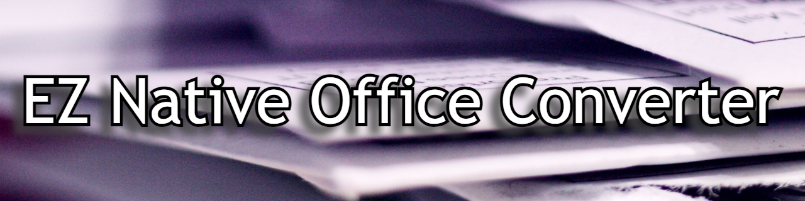
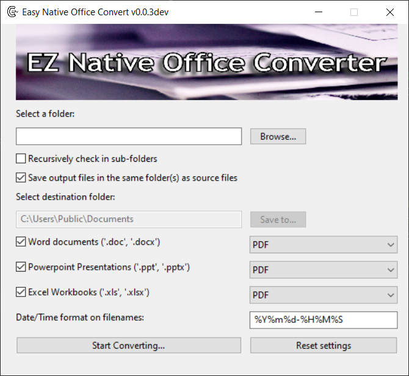

[](https://github.com/ofersadan85/ezno_convert/releases/latest)
[](https://pypi.org/project/ezno_convert/)
[](LICENSE)

Convert office files quickly and easily through CLI, GUI, or Windows Explorer context menu

### ezno-convert = Easy Native Office Convert
* *EZ* - Because it's so easy to convert large numbers of files
* *Native* - Because unlike other conversion programs, we convert using Microsoft Office's own COM API, which means it's your office programs doing their native job (instead of an external program that can mess up formatting, for example)

## What's good / bad about ezno-convert?

#### Pros:
- Free and open source, no ads, no premium charges
- Uses the native Office applications, so it will *ALWAYS* keep the formatting that those programs (and users) expect.
- Simple GUI and CLI interfaces, easy to run through context menu

#### Cons:
- Not scalable, the COM API isn't built for speed and takes up CPU and memory resources to open the Office programs in the background. Probably best to convert less than 100-200 documents at a time.


## Installation

- Option 1 (recommended): Download the latest release binary for windows [here]() and run the installer. **Easy.**
  
  This will enable you to run both the CLI version, and the GUI version (see below for [usage instructions](#usage))

  Additionally, this will create the **context menu** options in *Windows Explorer* for easy and fast conversion actions

  [](https://github.com/ofersadan85/ezno_convert/releases/latest)


- Option 2: Install as a python package 
    
      pip install -U ezno-convert
  [](https://pypi.org/project/ezno_convert/)
  
  

  This will only install the package and CLI script and dependencies, to use the package with GUI, see the next option


- Option 3: Install as a python package with GUI included

      pip install -U ezno-convert[gui]

## Usage

### GUI & Context menu

If you installed using out [latest installer]() you can now right click with your mouse on any folder in your computer (using *Windows Explorer*), and you'll see a new menu:

- Image

Clicking on it will open the main GUI with some options:



To convert all the files in the folder to the default PDF option, simply click the `Start Converting...` button. Each output file will be saved in the same location as the file being converted.

You can change the output folder in the GUI options. The other options in the GUI pretty much explain themselves, if you need additional help send us a question or open and issue and ask us to expand this documentation.

### CLI

Both the installer and pip package create a script called `eznoc.exe` that should be in your PATH (more on troubleshooting that later)

The basic usage involves only one argument - a path to a file or folder. Without any additional arguments, it will be converted to PDF by default and will be saved in the same folder as the input file. For example:

    eznoc C:\MyDocumentsFolder\

If you want all sub-folders to be included, include the `--recursive` or `-r` option

    eznoc -r C:\MyDocumentsFolder\

If you want to save the output files to a different location, use `--output` or `-o`:

    eznoc -o "C:\Output Folder" C:\MyDocumentsFolder\

You can see all the available command line options with `eznoc --help`:

```
> eznoc --help
usage: eznoc [-h] [-o PATH] [-c TYPE] [-t] [-d DATEFORMAT] [-l] [-v] [-r]
              [-w] [-p] [-x] [-a] [--split] [--sheet SHEET [SHEET ...]]
              PATH [PATH ...]

positional arguments:
  PATH                  Path(s) of files or folders to convert. If a folder is
                        specified, include all files in it (to filter types,
                        see folder options below)

optional arguments:
  -h, --help            show this help message and exit
  -o PATH, --output PATH
                        Where to save output files. If input PATH is a folder
                        (or multiple paths) this output PATH must also be a
                        folder. Default is to save output files in the same
                        folder as input files. If the output PATH isn't a
                        folder (input is a file) and the proper extension is
                        omitted, it will be added automatically.
  -c TYPE, --converter TYPE
                        Type of conversion to preform. For available types see
                        --list_types (Default: PDF)
  -t, --no_timestamp    Do not add timestamp to output filenames. Warning:
                        this will overwrite existing output files.
  -d DATEFORMAT, --dateformat DATEFORMAT
                        Specify datetime format to add to filenames. Ignored
                        if --no-timestamp specified. Default: %Y%m%d-%H%M%S
  -l, --list_types      Print available conversion types and exit
  -v, --version         show program's version number and exit

Folder Options:
  These options apply only to input paths that are folders, they are ignored
  otherwise

  -r, --recursive       Search in sub-folders recursively
  -w, --word            Convert all Word Documents ('.doc', '.docx')
  -p, --powerpoint      Convert all PowerPoint Presentations ('.ppt', '.pptx')
  -x, --excel           Convert all Excel Spreadsheets ('.xls', '.xlsx')
  -a, --all             Convert all possible files ('.doc', '.docx', '.ppt',
                        '.pptx', '.xls', '.xlsx'). Possible conversions depend
                        on conversion type. Example 1: "-a -c PDF" and "-a -c
                        XPS" will apply to all file types Example 2: "-a -c
                        AnimatedGIF" will only apply to PowerPoint
                        Presentations even without "-p"

Excel only options:
  These options apply only to excel files ('.xls', '.xlsx'), they are
  ignored otherwise

  --split               Convert each worksheet separately
  --sheet SHEET [SHEET ...]
                        Specify names or indexes of specific sheets to
                        convert, instead of converting the entire file.
                        Implies --split
```

### Python package

If you installed through `pip install ezno-convert` usage is pretty straightforward. Here are some examples:

    from ezno_convert import WORD, PPT, XL, convert_one, WORDConverter, PPTConverter

    # Convert one Word file to pdf
    convert_one('path\to\source.docx', 'path\to\output.pdf')

    # Convert every Excel sheet in a workbook to PDF separately
    convert_one('path\to\workbook.xlsx', sheets=True)

    # Convert only some sheets of an Excel workbook, to XPS format
    convert_one('path\to\workbook.xlsx', target=XL.XPS, sheets=('name of sheet', 'another sheet'))

    # Convert Word files to plain text, save to specific location, non-recursively
    WORDConverter(WORD, 'path\to\folder\', dst='path\to\output\', target=WORD.Text, recursive=False)

    # Convert all PowerPoint files in a folder to JPG, save in same place of source files, icluding recursive search in sub-folders
    PPTConverter(PPT, 'path\to\folder\', target=PPT.JPG, recursive=True)

Note that unlike `convert_one`, if you use instances of `BatchConverter` like `WORDConverter` the conversion **does not** start immediately. Iterate through it to actually preform the conversions. For example:

    converter = PPTConverter('path\to\folder\')
    for i, result in enumerate(converter):
        print(f'Converted {i} out of {len(converter)} documents ({result})')

Or execute all conversions in one go:

    results = converter.execute_all()

In both cases, the `result` or `results` returned are the paths of created files.
    

## Supported formats

Currently, only Word, Excel, and PowerPoint files are supported. Those can be converted to most popular formats that are supported natively in Microsoft Office (but not all).

We plan on expanding these options soon.

As of now, this program was only tested on Windows 10 and Office 365. If you tested it on other types of systems, please inform us by submitting an issue.

## Troubleshooting

The most likely failure is that you, or the installer, failed to add the installation folder to the PATH environment variable.

If you installed through `pip` make sure you have your pip scripts folder added to your PATH or use an administrator window to install.

If you installed through our installer, the installation location you selected is the one that needs to be added to PATH.

In either case, see [this guide](https://stackoverflow.com/questions/44272416/how-to-add-a-folder-to-path-environment-variable-in-windows-10-with-screensho) for adding folders to your PATH

## Contributing

If you would like to contribute or even ask for new features, feel free to open an issue, or a pull request.

## Warranty / Liability / Official support

This project is being developed independently without affiliation with Microsoft and not supported officially by them, we provide the
package "as-is" without any implied warranty or liability, usage is your own responsibility

## Additional info

Just because I like badges


